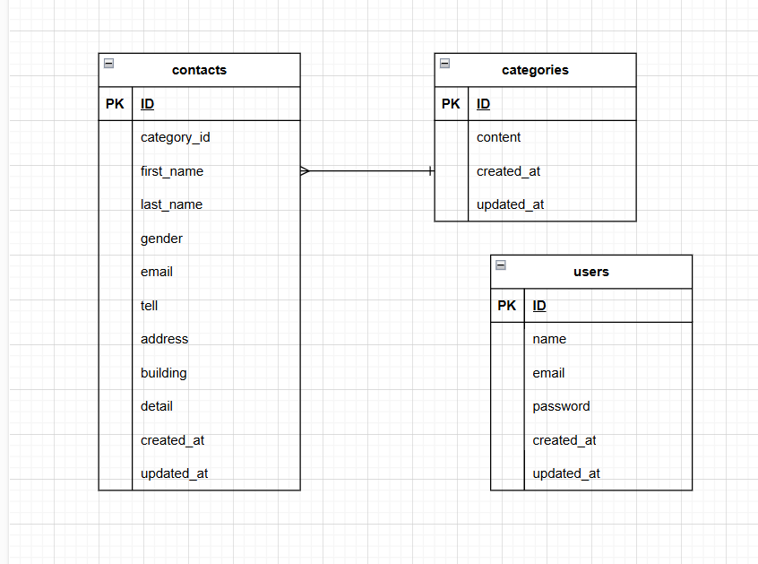

# アプリケーション名
FashionablyLate（お問い合わせフォーム）

## 使用技術（実行環境）
- フレームワーク: Laravel 8.83.29 (Laravel Sail)
- 言語: PHP 8.2.30
- データベース: MySQL 8.0.32
- デバッグツール: Xdebug v3.5.0
- 開発ツール: Docker / Docker Compose / Laravel Sail

## 環境構築
1. `cp .env.example .env`
2. `./vendor/bin/sail up -d`
3. `./vendor/bin/sail composer install`
4. `./vendor/bin/sail artisan key:generate`
5. `./vendor/bin/sail artisan migrate`
6. `./vendor/bin/sail artisan db:seed`

## 開発環境URL
- お問い合わせ画面: http://localhost/
- ユーザー登録: http://localhost/register
- 管理画面ログイン: http://localhost/login
- メール確認（Mailpit）: http://localhost:8025/

## 機能一覧
- お問い合わせ入力フォーム（バリデーション機能付き）
- お問い合わせ内容確認画面
- サンクスページ
- ユーザー登録・ログイン認証機能（Fortify）
- 管理者専用ログイン機能
- お問い合わせ検索機能（お名前、性別、お問い合わせの種類、日付）
- お問い合わせ詳細表示機能（モーダル表示）
- お問い合わせデータ削除機能
- 検索結果のCSV出力機能

## ER図

